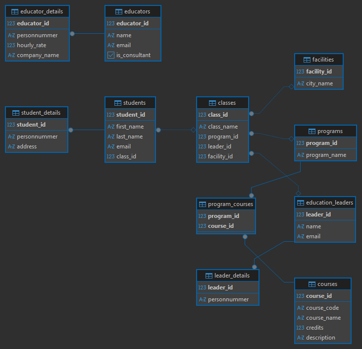

# 📊 YrkesCo Database Management System

A professional, 3rd Normal Form (3NF) relational database designed for **YrkesCo** to manage students, courses, programs, and staff across multiple cities.

## 🏛️ Architecture Overview
This project implements a secure "Vault" strategy to separate public information from sensitive GDPR-protected data (addresses and personnummer).

### Key Features:
* **Many-to-Many Relationships:** Courses are linked to multiple programs via a bridge table.
* **Security:** Separate tables for sensitive student, leader, and educator details.
* **Swedish Tech Context:** Specifically designed for Data Engineering and Cloud Architect programs.
* **Scalable Design:** Supports multiple facilities (Stockholm, Göteborg, etc.).

## 🗺️ Physical Model


## 🛠️ Installation & Usage
To reproduce this database:
1. Open **DBeaver** (or any PostgreSQL client).
2. Create a new database named `postgres`.
3. Open and execute the `Script.sql` file.

## 🧪 Verification Query

| Student Name | Class | Program | Location | Leader |
| :--- | :--- | :--- | :--- | :--- |
| Erik Johansson | DE-STHLM-24 | Data Engineer | Stockholm | Anders Svensson |
| Anna Lindgren | DE-STHLM-24 | Data Engineer | Stockholm | Anders Svensson |
| Michel Svensson | CLOUD-GBG-24 | Cloud Architect | Göteborg | Maja Lundqvist |

## 🚀 Deep-Dive Verification Query

To verify that all **11 tables** are correctly linked and that the **3rd Normal Form (3NF)** relationships are functioning, run the following "Grand Join" query. 

This query traverses the entire schema—from the physical **Facility** all the way to the **Consultant's Hourly Rate** in the hidden details vault.

### Query Instructions:
1. Open **DBeaver** or your SQL terminal.
2. Ensure you have executed the `Master_Script.sql` first.
3. Paste and run the code below:

```sql
SELECT 
    f.city_name AS "Campus",
    p.program_name AS "Program",
    cl.class_name AS "Class",
    el.name AS "Leader",
    eld.personnummer AS "Leader ID",
    s.first_name || ' ' || s.last_name AS "Student",
    sd.personnummer AS "Student ID",
    sd.address AS "Student Home",
    c.course_name AS "Course",
    e.name AS "Teacher",
    ed.hourly_rate AS "Consultant Rate"
FROM facilities f
JOIN classes cl ON f.facility_id = cl.facility_id
JOIN students s ON cl.class_id = s.class_id
JOIN student_details sd ON s.student_id = sd.student_id
JOIN programs p ON cl.program_id = p.program_id
JOIN education_leaders el ON cl.leader_id = el.leader_id
JOIN leader_details eld ON el.leader_id = eld.leader_id
JOIN program_courses pc ON p.program_id = pc.program_id
JOIN courses c ON pc.course_id = c.course_id
JOIN educators e ON c.educator_id = e.educator_id
JOIN educator_details ed ON e.educator_id = ed.educator_id
ORDER BY "Student", "Course";

---
*Created as part of the Database Management Lab by Michel - 2026.*# Database-Design-YrkesCo 
